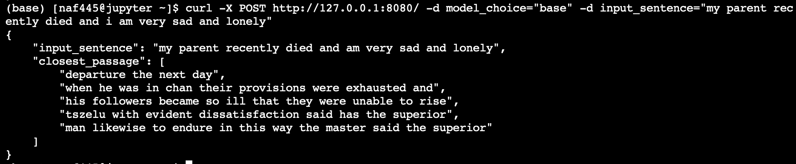
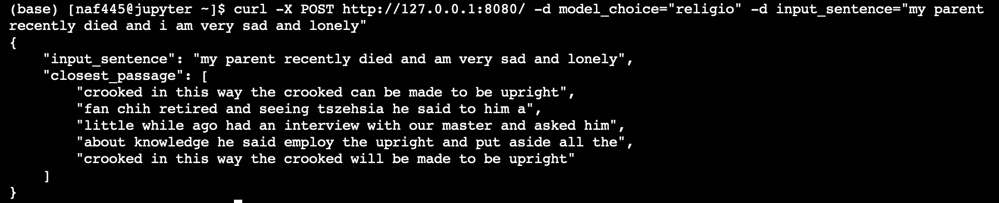
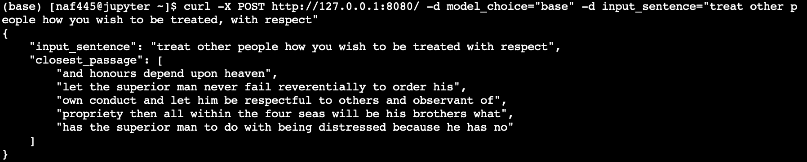
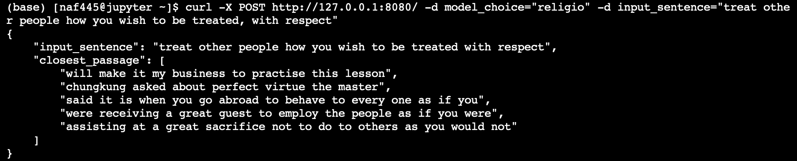

## Nathan Franklin
## Text Project, Part 3:
Determine and describe the approach/method you have chosen on your choice of NLP topic/task. Note that you might need to try out several techniques before settling on an approach. Run relevant experiments and record results. Write a one-to-two page description of 1) the method and 2) the results of your experiments.

---
For my NLP task, I have chosen to work with vector representations of words/sentences, specifically using the BERT implementation provided by the Huggingface Transformers implementation of BERT (https://github.com/huggingface/transformers).

My experiments involve comparing the performance of the uncased base BERT pre-trained model (12-layer, 768-hidden, 12-heads, 110M parameters) with a custom ReligioBERT model which begins with this baseBERT model and continues the pre-training step on a religious corpus. This religious corpus consisted of 10 religious texts, with details for each document found in the `README` of the code repository. The motivation for this approach comes from SciBERT, which trained a BERT model on a corpus of scientific documents, in order to get word embeddings which were more specialized for the types of vocabulary, syntax, and other language characteristics from this scientific world. Because eventually I wanted my word embeddings to be good at applying to religious words and concepts, and these words/concepts may not have been plentiful in the original corpus which BERT was trained on, I commenced with these further pre-training steps. Below is a comparison of how baseBERT fared with my ReligioBERT model in a couple of tasks.

### TSNE Visualizations

#### baseBERT

#### ReligioBERT

#### TSNE Plot Takeaways

BaseBERT TSNE projections actually separated things pretty intuitively, even with these specialized vocabulary words. For instance, negative connotation things like divorce/death/bad/suffer/pain/demon are grouped together, separate from others. Then more spiritual things were grouped together decently, with messiah/moses/jesus/pray/salvation and more all being somewhat close to each other. Interestingly the longer phrases were all grouped together.

ReligioBERT TSNE projections were fairly similar in its projection, and maybe even having a bit less intuitive projection groupings. Of course it's important to remember TSNE is a stochastic process and so there is some element of luck/randomness in creating and interpreting these. In fact the negative things, like punish/suffer/fear/death/divorce were much more spread out in the religioBERT projection. One hypothesis for this is that in normal text, these bad things may be less frequent, and more clustered together, but in religious texts, because these themes are more common, it may be that they are less strongly associated with each other. 

### Religious Text Recommendations

#### baseBERT

#### ReligioBERT

#### baseBERT

#### ReligioBERT

#### Text Recommendation Takeaways
I included here some output from my model. This model takes as input some user submitted string, creates a baseBERT or religioBERT 768 dimension numerical representation, and it finds the sentence in the Chinese Confucian Analects religious text which matches this user input embedding the closest. It then returns both the 2 sentences before and after to attempt to give some sort of matching passage. 

From the first user_input, "my parent recently died and I am very sad and lonely", baseBERT replied with a passage about superiors and departure, but it wasn't particularly relevant. ReligioBERT responded with a passage about "master" but it also was not particularly helpful. 

The second user_input ("treat other people how you wish to be treated, with respect") gave more interesting results. BaseBERT sent back a passage about a superior man being respectful to all others. ReligioBERT seemed to give a good passage, talking about advice when meeting new people, to always behave as if you are receiving many guests. It also mentions to "not to do to others as you would not..." which i'm assuming is a directly relevant to the topic the user input. 